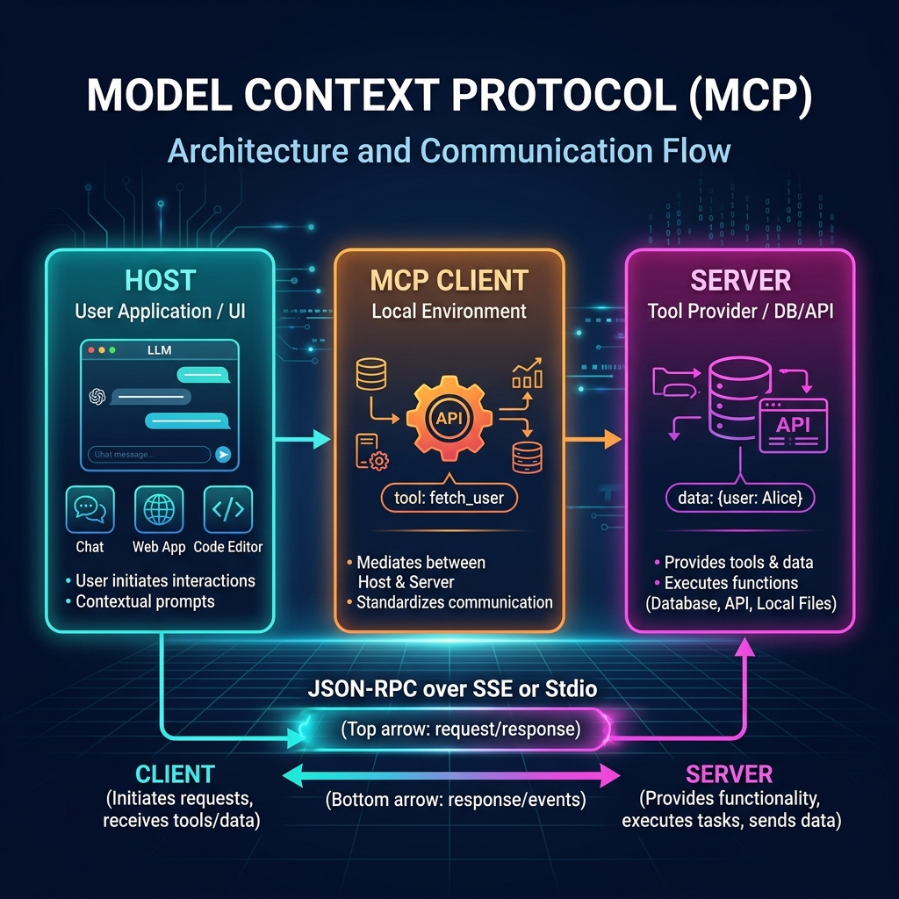

# 🎓 Model Context Protocol (MCP) Interactive Academy

An interactive, zero-setup learning platform designed to teach the **Model Context Protocol (MCP)**. This application runs completely **keyless and local** in a Streamlit container—allowing anyone to simulate real-time client-server protocol JSON exchanges and test their knowledge without needing LLM API keys or local database servers.

👉 **Live Hosted Demo**: [mcpserver-demo.streamlit.app](https://mcpserver-demo.streamlit.app/)

---

## 🔌 What is MCP?

The **Model Context Protocol (MCP)** is an open standard developed by Anthropic that connects AI models (like Claude) to external tools and data sources. Think of it as a **USB-C port for LLMs**: instead of writing custom API integration code for every tool, a server advertises its capabilities using a unified protocol schema, and the client plugs the tools directly into the LLM.



### Core Components of the Architecture:
1. **Host**: The user-facing application (e.g., Claude Desktop, Cursor editor, or this Streamlit UI).
2. **Client**: The session runner that coordinates LLM reasoning and server tool-calling.
3. **Server**: The tool and data provider (e.g., exposing a SQLite database, a weather API, or filesystem operations).
4. **Transport Layer**: The format of the wire communication (typically `Stdio` for local terminal subprocesses, or `SSE` (Server-Sent Events) over HTTP for remote services).

---

## 📖 Guided Walkthrough: How to Use the App

The app is divided into three learning tabs:

### 1. 📖 Tab 1: Learn Dashboard
* **Purpose**: Provides the conceptual foundation.
* **What to do**: Read the USB Port Analogy and study the sequence flow. Look at the **Three-Agent Architecture card** on the right to understand how the *Host*, *Client*, and *Server* interact.

---

### 2. 🎮 Tab 2: Interactive Protocol Simulator
This tab shows a live simulation of client-server communication. On the left side are the **Simulator Controls** and **Host Chat Mockup**. On the right side are the **📡 MCP Wire Protocol Logs** capturing raw JSON-RPC 2.0 messages.

#### **Setup**:
Select a mock backend tool from the dropdown:
* **Weather API**: Prompts about city weather.
* **Jobs Database Search**: Prompts about tech roles in Bangalore.
* **Calculator (Math API)**: Prompts with math equations.
* **Todo List Manager**: Prompts to add items to a personal task list.

*Selecting a tool automatically updates the simulated "User Prompt" box.*

#### **Step-by-Step Clicks**:

* **Click 1: `🔌 1. Initialize Handshake (Connect)`**
  * **What happens**: The Client opens a session and contacts the Server.
  * **Protocol Action**: Client sends an `initialize` JSON-RPC request containing client capabilities and metadata. The Server responds with its protocol version, capabilities, and server name.
  * **Wire Logs**: Look at the right panel to see the `initialize` request and `initialize_response` JSON packets.
  * **UI View**: Status updates from red/offline to `🟢 MCP Connected`.

* **Click 2: `🔍 2. Discover Tools (list_tools)`**
  * **What happens**: The Client queries the Server for all available tools it is authorized to call.
  * **Protocol Action**: Client sends `tools/list`. The Server replies with a list of tools including their exact **JSON Schema** parameters (types, descriptions, and required fields).
  * **Wire Logs**: Inspect the `result.tools` JSON block on the right to see the parameters the LLM will analyze.

* **Click 3: `🤖 3. LLM Decides & Calls Tool (call_tool)`**
  * **What happens**: The LLM reads the user prompt, matches it against the JSON schemas, and decides to execute a tool.
  * **Protocol Action**: The Client sends a `tools/call` JSON request carrying the tool name and extracted arguments (e.g., `{"city": "chennai"}` or `{"expression": "345 * 12"}`). The Server runs the database/API query locally and returns the raw result.
  * **UI View**: A tool invocation bubble appears in the chat mock view.

* **Click 4: `📝 4. Compile Final Answer`**
  * **What happens**: The Client passes the raw tool result back to the LLM. The LLM processes this data and compiles a clean, human-friendly markdown response.
  * **UI View**: The final AI response bubble appears in the chat mock view with the formatted answer.

---

### 3. 📝 Tab 3: Student Practice Center
This tab provides interactive activities to reinforce learning.

#### **Exercise 1: Protocol Flow Ordering**
* **Goal**: Learn the chronological sequence of an MCP session.
* **How to use**: Arrange the five protocol steps in order (from the initial connection to the final LLM compilation) using the dropdown menus. Click **Check Sequence** to validate. If incorrect, read the hints to fix your order.

#### **Exercise 2: Interactive Tool Schema Builder**
* **Goal**: Understand how to expose tool parameters to an LLM via **JSON Schema**.
* **How to use**:
  1. Define a parameter name (e.g., `salary` or `item`).
  2. Select its data type (string, integer, boolean, or array).
  3. Enter a description explaining to the LLM what the parameter represents.
  4. Toggle whether it is a required field.
* **What to observe**: As you change inputs, the standard-compliant **MCP Tool JSON Schema** auto-generates on screen in real-time. Click **Validate Schema** to get feedback.

#### **Exercise 3: MCP Concept Quiz**
* **Goal**: Test overall comprehension of MCP roles and transports.
* **How to use**: Complete the four multiple-choice questions covering host/client/server responsibilities, dynamic discovery, and stdio/SSE transports. Click **Submit Quiz Answers**. Getting a perfect **4/4** triggers a balloon animation and awards the **🏆 MCP Certified Scholar** badge!

---

## 🚀 Running the App Locally

To run this learning portal on your local machine, follow these steps:

```bash
# 1. Clone the repository
git clone https://github.com/Anilmidna/MCPServer-demo.git

# 2. Navigate to the client directory
cd MCPServer-demo/mcp-client

# 3. Install dependencies
pip install -r requirements.txt

# 4. Launch the Streamlit application
streamlit run app.py
```

Open your browser to **`http://localhost:8501`** and start practicing!
